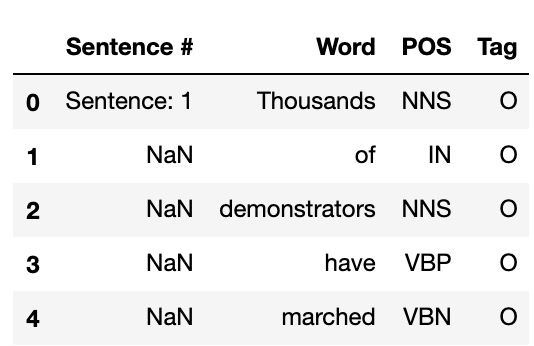
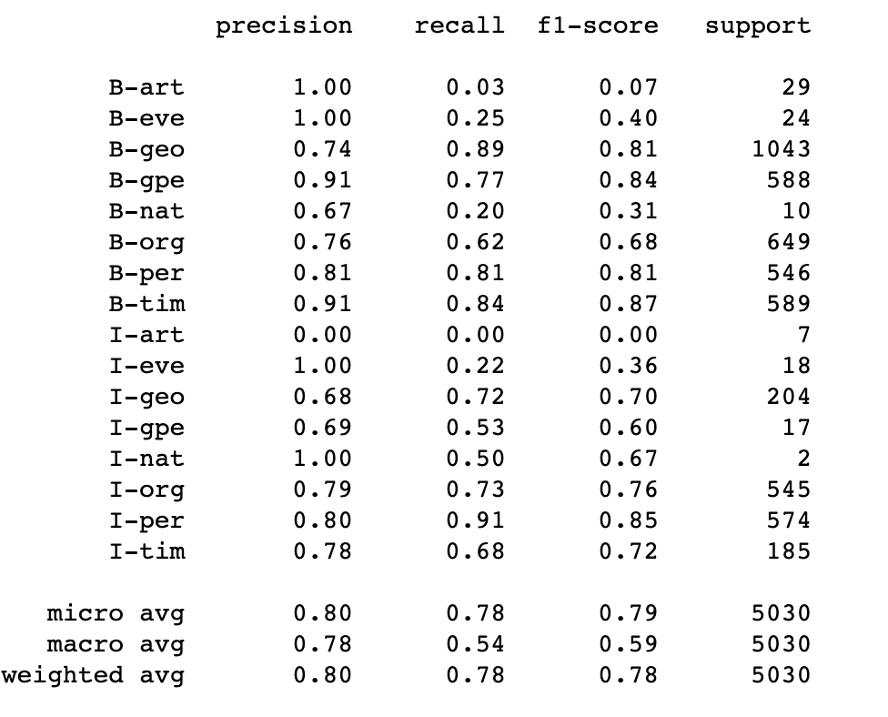

### 作业07
#### 利用条件随机场实现NER
- 用kaggle的ner数据集
- 提交完整代码
- 汇报模型评测结果
  
### 代码运行过程
#### 1. 读入Kaggle的数据

```python
import pandas as pd
import numpy as np
from sklearn.feature_extraction import DictVectorizer
from sklearn.feature_extraction.text import HashingVectorizer
from sklearn.linear_model import Perceptron
from sklearn.model_selection import train_test_split
from sklearn.linear_model import SGDClassifier
from sklearn.linear_model import PassiveAggressiveClassifier
from sklearn.naive_bayes import MultinomialNB
from sklearn.metrics import classification_report

df = pd.read_csv('ner_dataset.csv', encoding = "ISO-8859-1")
df = df[:100000]

df.head()
```

得到如下图所示的结果：




#### 从上面可以看到数据的第一列表明是句子的标号,同一个句子的词语只有第一个句首词语标明句子号，其余的词语则为空，第二列是关于句子中的不同单词，第三列是POS代表词性(Part of Speech Tag), 第四列是TAG表示命名实体标注如下：
- ([
 ORGANIZATION - Georgia-Pacific Corp., WHO
PERSON - Eddy Bonte, President Obama
LOCATION - Murray River, Mount Everest
DATE - June, 2008-06-29
TIME - two fifty a m, 1:30 p.m.
MONEY - 175 million Canadian Dollars, GBP 10.40
PERCENT - twenty pct, 18.75 %
FACILITY - Washington Monument, Stonehenge
GPE - South East Asia, Midlothian
])


#### 2. 对数据进行预处理

- 对数据进行去重

```python
df = df.fillna(method='ffill')
df['Sentence #'].nunique(), df.Word.nunique(), df.Tag.nunique()

```

- 对数据按照命名实体进行聚类，计算相同词性的数量

```python
df.groupby('Tag').size().reset_index(name='counts')

```

#### 3. 建立CRF模型

```python
import sklearn_crfsuite
from sklearn_crfsuite import scorers
from sklearn_crfsuite import metrics
from collections import Counter
class SentenceGetter(object):
    def __init__(self, data):
        self.n_sent = 1
        self.data = data
        self.empty = False
        agg_func = lambda s:[(w, p, t) for w, p, t in zip(s['Word'].values.tolist(), s['POS'].values.tolist(), s['Tag'].values.tolist())]
        self.grouped = self.data.groupby('Sentence #').apply(agg_func)
        self.sentences = [s for s in self.grouped]
    
    def get_next(self):
        try:
            s = self.grouped['Sentence: {}'.format(self.n_sent)]
            self.n_sent += 1
            return s
        except:
            return None
    
getter = SentenceGetter(df)
sentences = getter.sentences

def word2features(sent, i):
    word = sent[i][0]
    postag = sent[i][1]

    features = {
        'bias': 1.0,
        'word.lower()': word.lower(),
        'word[-3:]': word[-3:],
        'word[-2:]': word[-2:],
        'word.isupper()': word.isupper(),
        'word.istitle()': word.istitle(),
        'word.isdigit()': word.isdigit(),
        'postag': postag,
        'postag[:2]': postag[:2],
    }
    if i > 0:
        word1 = sent[i-1][0]
        postag1 = sent[i-1][1]
        features.update({
            '-1:word.lower()': word1.lower(),
            '-1:word.istitle()': word1.istitle(),
            '-1:word.isupper()': word1.isupper(),
            '-1:postag': postag1,
            '-1:postag[:2]': postag1[:2],
        })
    else:
        features['BOS'] = True

    if i < len(sent)-1:
        word1 = sent[i+1][0]
        postag1 = sent[i+1][1]
        features.update({
            '+1:word.lower()': word1.lower(),
            '+1:word.istitle()': word1.istitle(),
            '+1:word.isupper()': word1.isupper(),
            '+1:postag': postag1,
            '+1:postag[:2]': postag1[:2],
        })
    else:
        features['EOS'] = True

    return features


def sent2features(sent):
    return [word2features(sent, i) for i in range(len(sent))]

def sent2labels(sent):
    return [label for token, postag, label in sent]

def sent2tokens(sent):
    return [token for token, postag, label in sent]
```

#### 4. 训练和测试

```python
X = [sent2feaures(s) for s in sentences]
y = [sent2labels(s) for s in sentences]
X_train, X_test, y_train, y_test = train_test_split(X, y, test_size=0.33, random_state=0)
crf = sklearn_crfsuite.CRF(
    algorithm='lbfgs',
    c1=0.1,
    c2=0.2,
    max_iterations=100,
    all_possible_transitions=True
)
crf.fit(X_train, y_train)
labels = list(crf.classes_)
labels.remove('O')
new_classes = sorted(
    labels,
    key=lambda name: (name[0], name[1:])
)
y_pred = crf.predict(X_test)
print(metrics.flat_classification_report(y_test, y_pred, labels = new_classes))
```

#### 5. 通过CRF训练和测试之后，我们得到的结果如下图所示：


